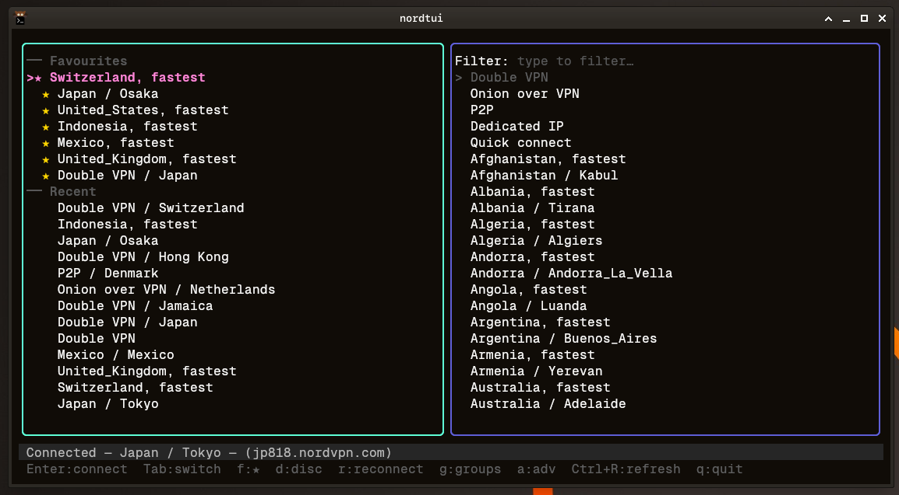
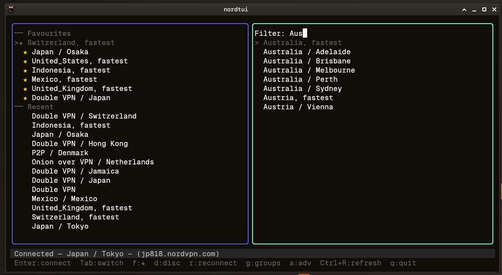

# nordtui

A keyboard-driven terminal UI for switching NordVPN locations quickly.

The NordVPN GUI keeps only a tiny recent-node list and makes browsing locations slow. nordtui gives you a two-pane interface: your saved and recent locations on the left for fast reconnects, and a searchable full location list on the right.





## Layout

```
┌─ NordVPN TUI  v0.1.12 ─────────────────────────────────────────┐
├─────────────────────────┬──────────────────────────────────────┤
│ Saved                   │ Filter:                              │
│                         │                                      │
│ ── Favourites           │   Double VPN                         │
│ ★ Netherlands, fastest  │   Onion over VPN                     │
│ ★ UK / Manchester       │   P2P                                │
│ ★ Switzerland, fastest  │   Dedicated IP                       │
│                         │ > Quick connect                      │
│ ── Recent               │   Albania, fastest                   │
│ > Germany / Berlin      │ ● United Kingdom, fastest            │
│   Sweden, fastest       │   ...                                │
├─────────────────────────┴──────────────────────────────────────┤
│ ● Connected — United Kingdom / Manchester (uk1234)             │
│ Enter connect  Tab switch  f:★  d:disc  g:groups  q quit       │
└────────────────────────────────────────────────────────────────┘
```

Startup focus lands on the Saved pane so the most common workflow — reconnect to a recent node — is a single keypress.

The status bar always retains the current VPN connection while temporary notices are shown. A green `●` also marks the connected country and, when available, its exact city in the location and saved lists.

## Requirements

- Linux
- [`nordvpn` CLI](https://nordvpn.com/download/linux/) installed and logged in
- Go 1.21+ (to build from source)

## Install

```sh
git clone https://github.com/subbaan/nordtui
cd nordtui
make build
cp nordtui-bin ~/.local/bin/nordtui
```

Or grab the binary from [Releases](../../releases).

## Usage

```
nordtui              Launch the TUI
nordtui --help       Show help and key bindings
nordtui --version    Print version
```

## Key bindings

| Key | Action |
|-----|--------|
| `Tab` | Cycle focus: Saved → Filter → Locations → Saved |
| `↑` `↓` `k` `j` | Move selection |
| `Enter` | Connect to selected target |
| `/` | Jump to filter input |
| `f` | Toggle favourite on selected entry |
| `d` | Disconnect VPN |
| `g` | Toggle specialty server groups (Double VPN, Onion over VPN, P2P, Dedicated IP) |
| `Esc` (in group) | Return from country picker to main list |
| `s` | Refresh status |
| `r` | Reconnect last connection |
| `Esc` | Clear filter / return to Saved pane |
| `Ctrl+R` | Force refresh location cache |
| `Ctrl+D` | Delete selected recent entry |
| `q` `Ctrl+C` | Quit |

## Config and state

| Path | Contents |
|------|----------|
| `~/.config/nordtui/config.json` | Preferences and favourites |
| `~/.local/state/nordtui/recent.json` | Recent connection history |
| `~/.local/state/nordtui/cache.json` | Cached country/city list |

The location cache refreshes automatically in the background if it is older than 24 hours.

## Built with

- [Bubble Tea](https://github.com/charmbracelet/bubbletea) — TUI framework
- [Lipgloss](https://github.com/charmbracelet/lipgloss) — layout and styling
